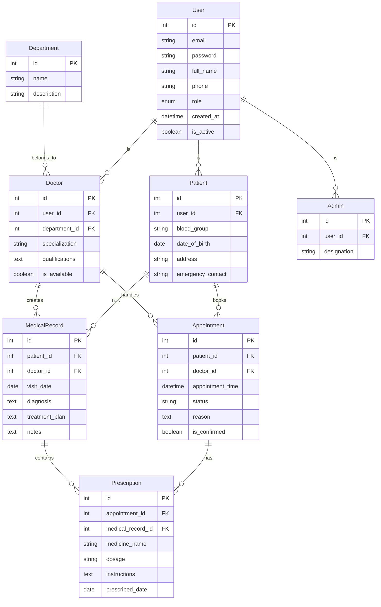

# **Healthcare Management System**  

## **Overview**  
This project is a **Healthcare Management System** designed to manage users, including **patients, doctors, and admins**, as well as **appointments, medical records, prescriptions, and departments**. The system aims to streamline patient care by providing an efficient platform to manage patient records, appointments, and prescriptions through assigned healthcare providers.

---
## **ERD Diagram**  
Below is the **Entity-Relationship Diagram (ERD)** representing the database structure of the system:


## **Features**
- User roles: Admin, Doctor, and Patient.
- Patients can book appointments with doctors.
- Doctors handle appointments and create medical records.
- Medical records contain diagnosis, treatment plans, and other relevant notes.
- Prescriptions are generated for appointments and linked with medical records.
- Admins can manage departments and assign doctors.

---

## **Entity Relationship Diagram (ERD)**  
The following ER diagram demonstrates the relationships between different entities in the system:



---

## **Database Structure**  

### **1. User**  
- `id`: Primary Key  
- `email`: User’s email address  
- `password`: Encrypted password  
- `full_name`: Full name of the user  
- `phone`: Contact number  
- `role`: Enum representing user role (Admin, Doctor, Patient)  
- `created_at`: Timestamp for account creation  
- `is_active`: Boolean to mark if the user is active  

### **2. Patient**  
- `id`: Primary Key  
- `user_id`: Foreign Key to User  
- `blood_group`: Patient's blood group  
- `date_of_birth`: Date of birth  
- `address`: Patient's address  
- `emergency_contact`: Emergency contact information  

### **3. Doctor**  
- `id`: Primary Key  
- `user_id`: Foreign Key to User  
- `department_id`: Foreign Key to Department  
- `specialization`: Doctor's specialization  
- `qualifications`: Doctor's qualifications  
- `is_available`: Availability status  

### **4. Admin**  
- `id`: Primary Key  
- `user_id`: Foreign Key to User  
- `designation`: Admin's designation  

### **5. Appointment**  
- `id`: Primary Key  
- `patient_id`: Foreign Key to Patient  
- `doctor_id`: Foreign Key to Doctor  
- `appointment_time`: Appointment date and time  
- `status`: Status of the appointment (e.g., Pending, Confirmed, Cancelled)  
- `reason`: Reason for appointment  
- `is_confirmed`: Boolean to mark confirmation status  

### **6. Medical Record**  
- `id`: Primary Key  
- `patient_id`: Foreign Key to Patient  
- `doctor_id`: Foreign Key to Doctor  
- `visit_date`: Date of visit  
- `diagnosis`: Diagnosis details  
- `treatment_plan`: Treatment plan for the patient  
- `notes`: Additional notes  

### **7. Prescription**  
- `id`: Primary Key  
- `appointment_id`: Foreign Key to Appointment  
- `medical_record_id`: Foreign Key to MedicalRecord  
- `medicine_name`: Name of the medicine prescribed  
- `dosage`: Dosage information  
- `instructions`: Additional instructions for the patient  
- `prescribed_date`: Date of prescription  

### **8. Department**  
- `id`: Primary Key  
- `name`: Department name  
- `description`: Description of the department  

---

## **How to Use This Project**  

### **Prerequisites**  
1. Python 3.x  
2. Django 4.x  
3. Django Rest Framework  

### **Installation Steps**  
1. Clone the repository:  
   ```bash
   git clone <repository_url>
   cd <repository_name>
   ```

2. Create and activate a virtual environment:  
   ```bash
   python -m venv venv  
   source venv/bin/activate  # On Windows: venv\Scripts\activate
   ```

3. Install the dependencies:  
   ```bash
   pip install -r requirements.txt
   ```

4. Run migrations to create the database:  
   ```bash
   python manage.py migrate
   ```

5. Create a superuser for the admin panel:  
   ```bash
   python manage.py createsuperuser
   ```

6. Start the development server:  
   ```bash
   python manage.py runserver
   ```

---

## **Usage Instructions**  
- Access the **admin panel** at `http://127.0.0.1:8000/admin/`  
- Use the **API endpoints** through Swagger UI (if configured) at `http://127.0.0.1:8000/swagger/`  

---

## **Contributing**  
Feel free to open issues or submit pull requests if you find bugs or want to improve the system.

---

## **License**  
This project is licensed under the **BSD License**. See the [LICENSE](LICENSE) file for more information.

---

## **Contact**  
For any queries, please contact:  
**Email**: contact@yourapi.local  

---

This README provides all the necessary information to understand, install, and use your project effectively. Let me know if you need further customization or additions!
